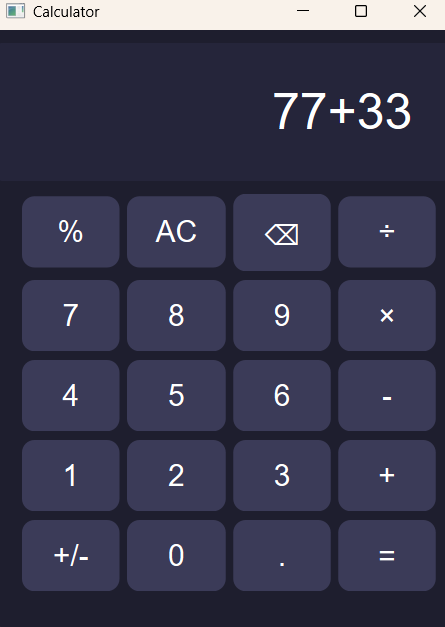
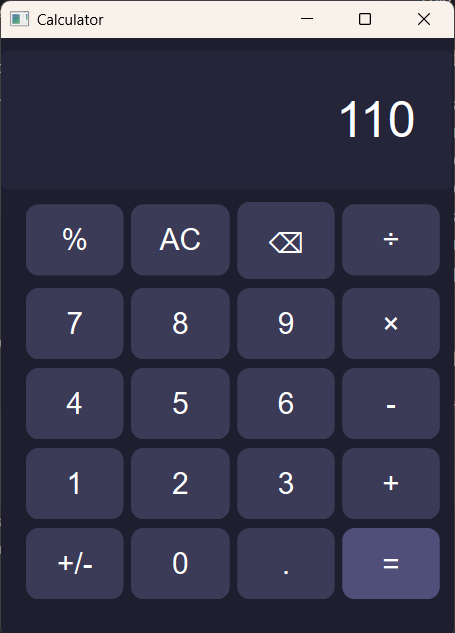
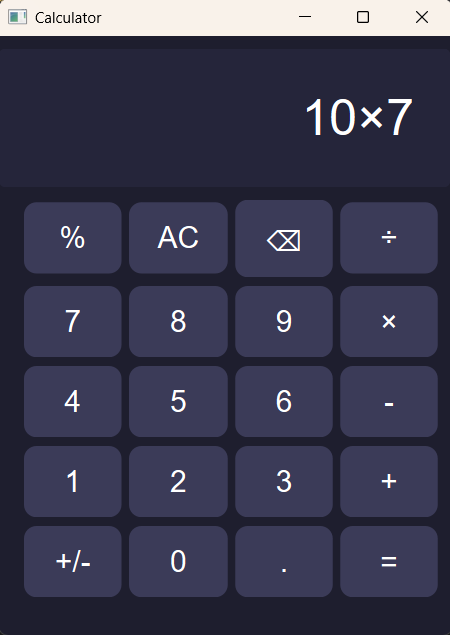
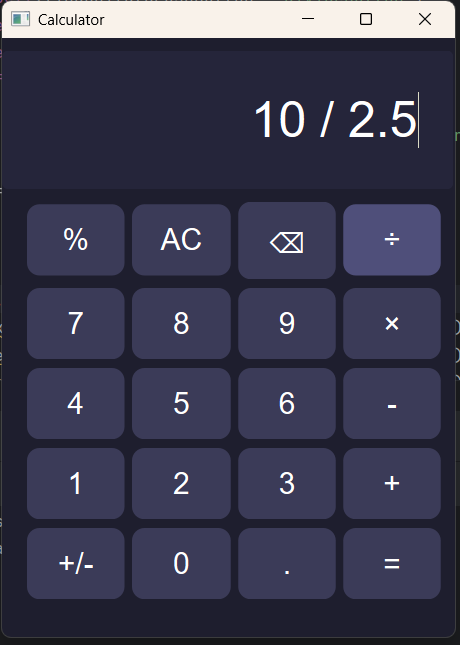
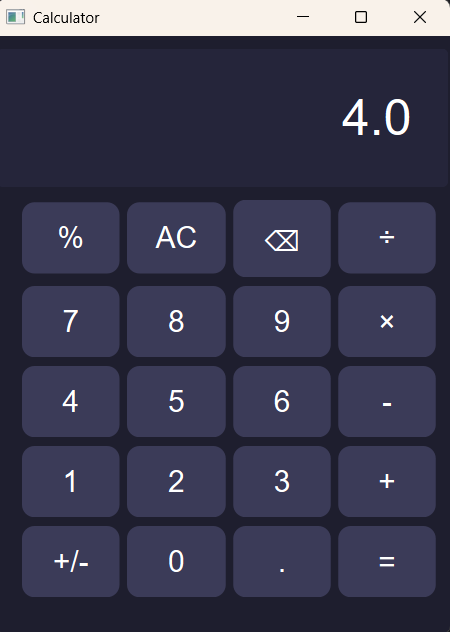

# PyQt6 Calculator  

A simple calculator built using **PyQt6**. This project includes basic arithmetic operations, percentage calculations, and the ability to toggle positive/negative values.

## Features  
- Addition, subtraction, multiplication, and division  
- Percentage calculation  
- Toggle positive/negative values (`+/-`)  
- Clear and delete functions  
- Decimal point support  

## Class and Method Documentation
### MyWindow Class
This is the main class that defines the calculator window and its functionality.

### Methods:
- add_to_expression(button: str): Adds digits or operators to the input field.
- remove_last_char(): Deletes the last entered character.
- clear_expression(): Clears the input field.
- calculate(): Evaluates the expression and displays the result.
- add_decimal(): Ensures only one decimal point is added per number.
- make_plus_minus(): Toggles the sign of the current input.
- percentage(): Converts the last number in the expression to a percentage.

## Sample Runs

### Example 1

### Example 2

  
### Example 3

